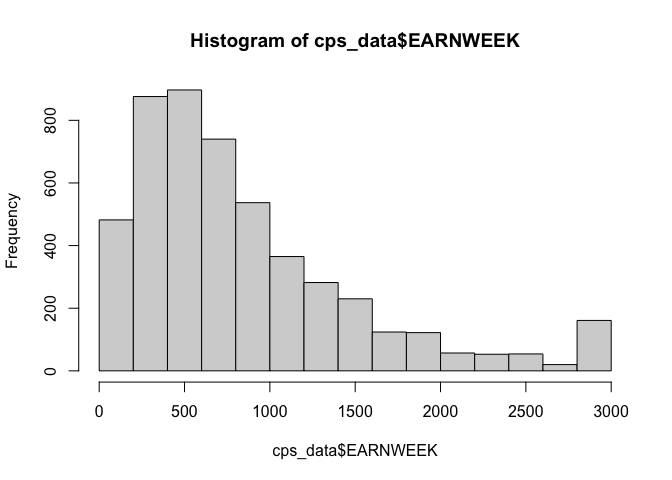
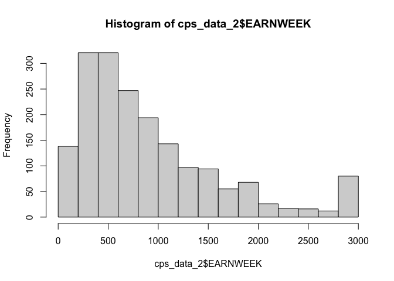
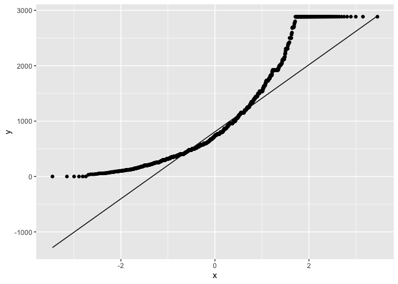

Geog4/6300: Lab 4
================

## One and two sample difference tests; ANOVA; Goodness of fit tests

**Overview:** This lab continues work with the CPS dataset you used in
Lab 3. You’ll be conducting normality tests, two sample t tests, chi
square tests, and ANOVA to test for differences within these data.

\###Part 1: Testing the normality of the EARNWEEK variable

We’re going to look at the variable for average weekly income: EARNWEEK.
Load the IPMUS CPS dataset in this repository using read_csv. Filter
these data so you have only valid responses, removing any observations
with a value of 9999.99. Now let’s test the normality of this variable.

**Question 1** *Load the CPS data and filter it to only valid
responses.*

``` r
cps_data<-read_csv("data/IPUMS_CPS_FoodSec.csv") %>%
  select(EARNWEEK) %>%
  na.omit(EARNWEEK) %>%
  subset(EARNWEEK!=9999.99)
```

    ## Rows: 531033 Columns: 29
    ## ── Column specification ────────────────────────────────────────────────────────
    ## Delimiter: ","
    ## chr  (3): STATE, Region, FSSTATUS_cat
    ## dbl (26): YEAR, CPSID, STATEFIP, STATECENSUS, METAREA, FSSTATUS, FSSTATUSA, ...
    ## 
    ## ℹ Use `spec()` to retrieve the full column specification for this data.
    ## ℹ Specify the column types or set `show_col_types = FALSE` to quiet this message.

**Question 2** *To assess the normality of the EARNWEEK variable, you
create a random sample of 5,000 records using the sample_n function
(look it up in help for more information). That’s because the
Shapiro-Wilk test can’t handle more than that many records. Create that
sample using slice_sample and then do the following: 1) Perform a
Shapiro-Wilk normality test on this variable. 2) Create a Q-Q plot with
a line showing the normal distribution. 3) Create a histogram using
ggplot or the base R function.*

``` r
cps_data<-cps_data %>%
  sample_n(size = 5000)
shapiro.test(cps_data$EARNWEEK)
```

    ## 
    ##  Shapiro-Wilk normality test
    ## 
    ## data:  cps_data$EARNWEEK
    ## W = 0.8688, p-value < 2.2e-16

``` r
hist(cps_data$EARNWEEK)
```

<!-- -->

``` r
ggplot(cps_data,aes(sample=EARNWEEK)) +
  stat_qq()+
  stat_qq_line()
```

<!-- -->

**Question 3** *Based on the results you saw in question 2, is this
variable normally distributed? How do each of those three tests inform
your decision?*

{The variable is not normally distributed, it is skewed. The p-value
from the Shapiro test is less than 0.05, therefore we reject the
hypothesis for normality. The histogram is visibly skewed right, and
therefore has a non-normal, non-bell-shaped distribution. The QQ plot
deviates significantly from the diagonal, normally-distributed line, and
is therefore non-normal in nature.}

\###Part 2: Testing the differences between states###

Based on the results of the previous questions, test whether the incomes
of survey respondents in Atlanta (METAREA code 521) and Chicago (1605)
metropolitan areas were equal or different.

**Question 4** *Based on the normality of the data, what is the
appropriate statistical test for determining if actual household incomes
between these cities are significantly different (p=0.05)? Explain why
this test is appropriate and give a null and alternative hypothesis for
this test*

{Because the data are non-normal, the unpaired two-sample Wilcoxon test
would be the most appropriate statistical test to use. This is because
it is a non-parametric alternative to the unpaired two-samples t-test,
can be used to compare two independent groups of samples, and the data
are not normally distributed. Null hypothesis: actual household incomes
between cities are not significantly different. Alternative hypothesis:
actual household incomes between cities are significantly different.}

**Question 5** *Run the test you identified in question 4. Be sure to
use the FULL sample for both cities (not the smaller sample from
Question 2) Also identify the mean and median values for each dataset.*

``` r
cps_data_2<-read_csv("data/IPUMS_CPS_FoodSec.csv") %>%
  select(EARNWEEK | METAREA) %>%
  filter(METAREA=="521" | METAREA=="1605") %>%
  na.omit(EARNWEEK) %>%
  subset(EARNWEEK!=9999.99)
```

    ## Rows: 531033 Columns: 29
    ## ── Column specification ────────────────────────────────────────────────────────
    ## Delimiter: ","
    ## chr  (3): STATE, Region, FSSTATUS_cat
    ## dbl (26): YEAR, CPSID, STATEFIP, STATECENSUS, METAREA, FSSTATUS, FSSTATUSA, ...
    ## 
    ## ℹ Use `spec()` to retrieve the full column specification for this data.
    ## ℹ Specify the column types or set `show_col_types = FALSE` to quiet this message.

``` r
cps_data_ATL<-cps_data_2 %>%
  filter(METAREA=="521") %>%
  mutate(atl_mean=mean(EARNWEEK), atl_median=median(EARNWEEK))

cps_data_CHI<-cps_data_2 %>%
  filter(METAREA=="1605") %>%
  mutate(chi_mean=mean(EARNWEEK), chi_median=median(EARNWEEK))

res <- wilcox.test(EARNWEEK ~ METAREA, data = cps_data_2,
                   exact = FALSE)

shapiro.test(cps_data_2$EARNWEEK)
```

    ## 
    ##  Shapiro-Wilk normality test
    ## 
    ## data:  cps_data_2$EARNWEEK
    ## W = 0.87371, p-value < 2.2e-16

``` r
hist(cps_data_2$EARNWEEK)
```

<!-- -->

``` r
ggplot(cps_data_2,aes(sample=EARNWEEK)) +
  stat_qq()+
  stat_qq_line()
```

<!-- -->

**Question 6** *Interpret the results of the analysis you did in
question 4. Do you reject the null hypothesis? Why or why not? What can
we say about household incomes in these two metros, focusing on the
significance of the test result and the actual difference in means?*

{The p-value from the Wilcoxon test in Question 5 = 0.0674, which is
greater than the given level of significance (P=0.05). Therefore, we can
say that our p-value of 0.0674 is not statistically significant and
indicates strong evidence in favor of the null hypothesis. This means
that we retain the null hypothesis and reject the alternative
hypothesis. In doing so, we are stating that the actual household
incomes between cities are not significantly different, given the
significance of the test result and actual differences in
means/medians.}

\###Part 3: Analyzing differences in rates for use of food assistance

While the U.S. Census regularly provides data on use of SNAP/Food stamp
benefits, the CPS provides data on other emergency food sources. Here,
you will look at use of emergency food from a church, food pantry, or
food bank over the last year (FSFDBNK) in New York, New Jersey, and
Pennsylvania.

**Question 7** *Reload the original CPS dataset (so that you’re not
filtering out based on EARNWEEK as you did in question 1). Now filter
for records with valid responses to FSFDBNK (\<6 on the scale) that are
in the states listed above. Call the head of the table with kable when
done*

``` r
cps_data_food<-read_csv("data/IPUMS_CPS_FoodSec.csv") %>%
  filter(STATE=="New York" | STATE=="New Jersey" | STATE=="Pennsylvania") %>%
  filter(FSFDBNK=="5" | FSFDBNK=="4" | FSFDBNK=="3" | FSFDBNK=="2" |  FSFDBNK=="1") %>%
  select(STATE | FSFDBNK)
```

    ## Rows: 531033 Columns: 29
    ## ── Column specification ────────────────────────────────────────────────────────
    ## Delimiter: ","
    ## chr  (3): STATE, Region, FSSTATUS_cat
    ## dbl (26): YEAR, CPSID, STATEFIP, STATECENSUS, METAREA, FSSTATUS, FSSTATUSA, ...
    ## 
    ## ℹ Use `spec()` to retrieve the full column specification for this data.
    ## ℹ Specify the column types or set `show_col_types = FALSE` to quiet this message.

``` r
kable(head(cps_data_food))
```

| STATE    | FSFDBNK |
|:---------|--------:|
| New York |       1 |
| New York |       1 |
| New York |       1 |
| New York |       1 |
| New York |       4 |
| New York |       4 |

**Question 8** *Create a contingency table of responses to the FSFDBNK
variable by state. This should show the number of observations in each
category for each state. Then conduct a chi square test on this table.*

``` r
cps_data_food_table<-cps_data_food %>%
  group_by(FSFDBNK, STATE) %>%
  count(FSFDBNK) %>%
  pivot_wider(names_from = STATE, values_from = n, values_fill = 0)
chisq.test(cps_data_food_table)
```

    ## Warning in chisq.test(cps_data_food_table): Chi-squared approximation may be
    ## incorrect

    ## 
    ##  Pearson's Chi-squared test
    ## 
    ## data:  cps_data_food_table
    ## X-squared = 715.86, df = 12, p-value < 2.2e-16

**Question 9** *What were your null and alternative hypotheses for the
chi square test? Based on the results of your analysis, what conclusions
can you make about food bank usage? Refer to the actual differences in
rates between states as well as significance in your interpretation.*

{Null hypothesis: There is no association between emergency food bank
usage and state (NJ, NY, PA) Alternative hypothesis: There is an
association between emergency food bank usage and state (NJ, NY, PA) The
calculated chi-square value (715.86) is greater than the chi-square
critical value (21.026 for 0.05 significance level), and the calculated
chi-square p-value (2.2e-16) is less than the standard p-value of 0.05.
This indicates that there is sufficient evidence to conclude that the
observed distribution is not the same as the expected distribution, and
we can conclude that an association exists between state and emergency
food bank usage.}

\###Bonus challenge! Pick one other variable from this CPS dataset and
create an appropriate state level estimate. This will probably involve
calculating a rate (e.g., % immigrant) or average (e.g., mean year of
immigration). Map out your estimate using the states_albers geopackage
file in the data folder for this lab.

``` r
#Code goes here
```

Pick two states and test whether they statistically differ with regards
to the variable you created. This will mean testing the normality of the
variable, running the appropriate difference test, and interpreting the
results. In addition to your code, write a short description of your
process, explaining what your results show and why you used the test you
did.

``` r
#Code goes here
```

{Explanation goes here.}

**Lab reflection:** *How do you feel about the work you did on this lab?
Was it easy, moderate, or hard? What were the biggest things you learned
by completing it?*

{I feel a bit uncertain about the work I did on this lab. I’m not
particularly well-versed/proficient with these statistical tests and
interpreting their results, so while I feel like I answered each
question successfully and to the best of my abilities, I feel a bit
insecure about that. This lab was moderately challenging, hedging
towards the hard side of the spectrum, but only because of the depth of
understanding (regarding these tests and concepts) required to
successfully complete this lab is as deep as it is. I suppose that the
biggest lessons I learned throughout this lab were the different
statistical tests, what each test for, their applications, and how to
interpret their results.}
